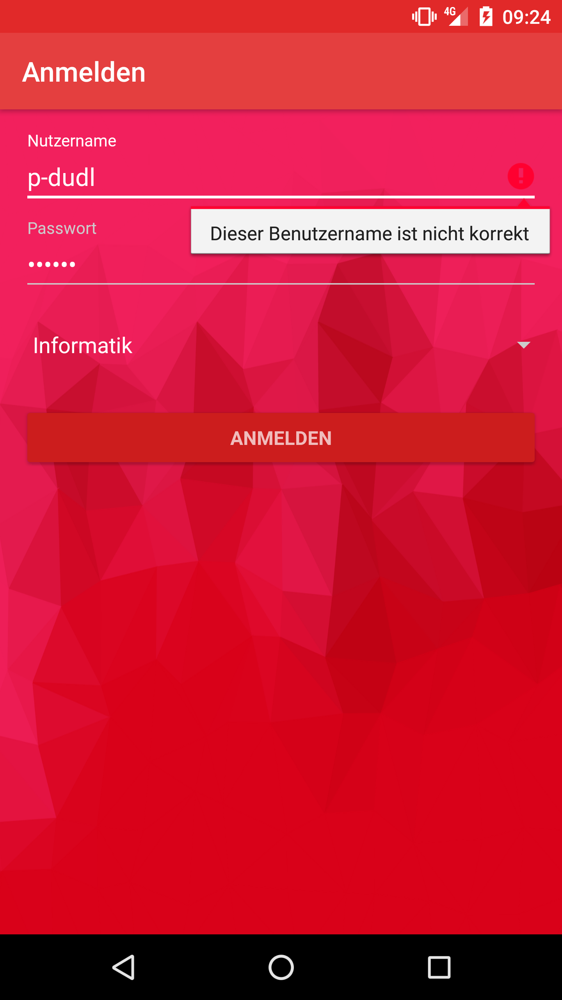
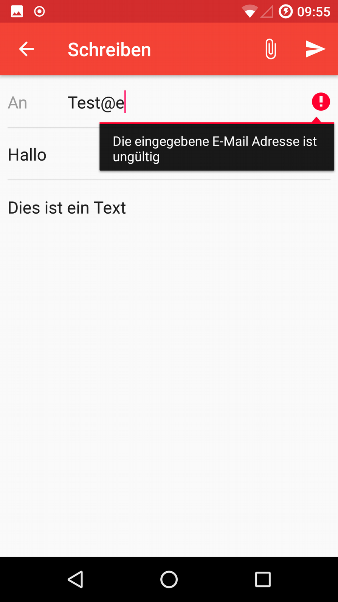
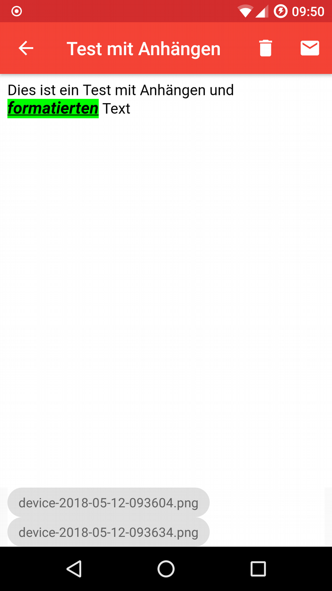
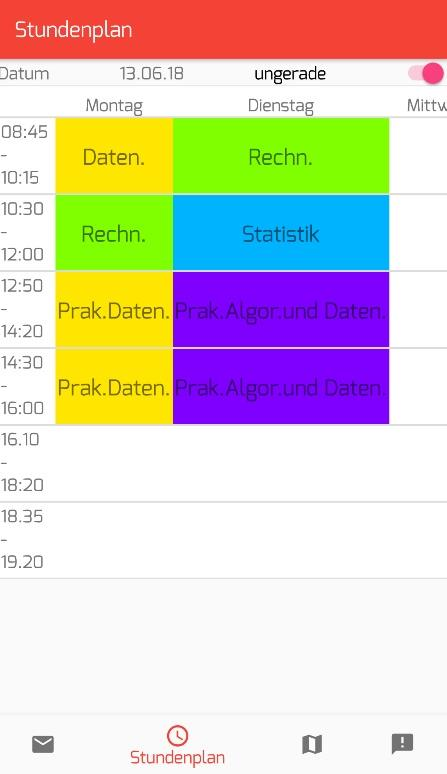
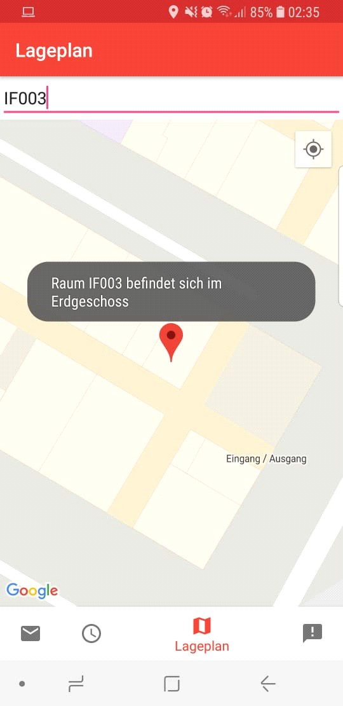
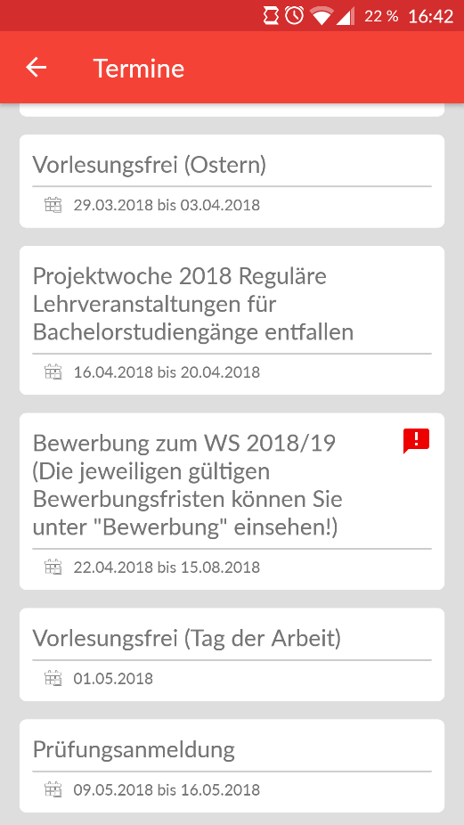

# HAWMobile

HAWMobile war ein Studienprojekt an der Hochschule für angewandte Wissenschaften in Landshut, welche den Studentenalltag erleichtern soll.
Teil der App ist eine bereits vorkonfigurierte E-Mail-Anwendung, ein Stundenplan, ein Lageplan sowie eine Übersicht über Termine und kommende Events.

### Login Bildschirm

## E-Mail-Anwendung
### E-Mail-Übersicht

### E-Mail-Erstellung

### E-Mail-Anzeige

## Stundenplan

## Lageplan

## Kalender
### News

### Termine

